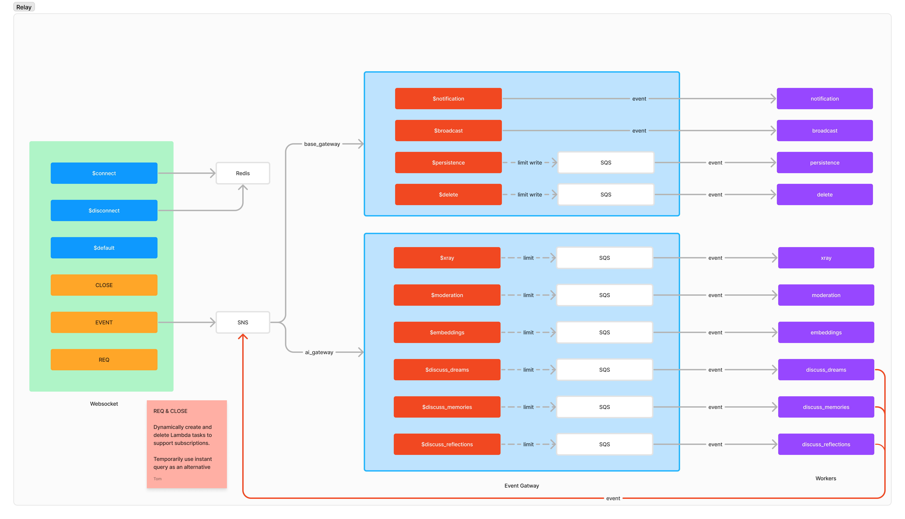

# Tripiz Relay

This is a nostr serverless relay, written in TypeScript. It currently supports the entire relay protocol, and persists data with AstraDB and DynamoDB.

## Nostr Protocol Support

[nostr-protocol NIPs](https://github.com/nostr-protocol/nips/tree/master)

- [x] NIP-01: Basic protocol flow description
- [ ] NIP-02: Contact List and Petnames
- [ ] NIP-03: OpenTimestamps Attestations for Events
- [ ] NIP-05: Mapping Nostr keys to DNS-based internet identifiers
- [x] NIP-09: Event Deletion
- [ ] NIP-11: Relay Information Document
- [ ] NIP-12: Generic Tag Queries
- [ ] NIP-15: End of Stored Events Notice
- [ ] NIP-16: Event Treatment
- [ ] NIP-20: Command Results
- [ ] NIP-22: Event created_at limits (future-dated events only)
- [ ] NIP-26: Event Delegation (implemented, but currently disabled)
- [ ] NIP-28: Public Chat
- [ ] NIP-33: Parameterized Replaceable Events
- [ ] NIP-40: Expiration Timestamp
- [ ] NIP-42: Authentication of clients to relays

## Tripiz Support

- [x] Memories: Zweig
- [x] Dreams: Carl Jung
- [x] Reflections
