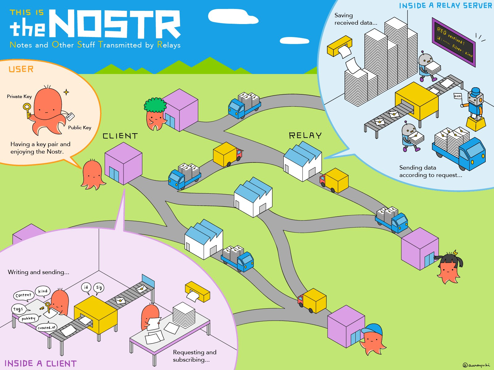

# Nostr Relay

This is a nostr serverless relay, written in TypeScript. It currently supports the entire relay protocol, and persists
data with AstraDB and DynamoDB.

## Nostr Protocol Support

- [x] NIP-01: Basic protocol flow description
- [x] NIP-09: Event Deletion
- [x] NIP-94: File Metadata
- [ ] NIP-71: Video Events
